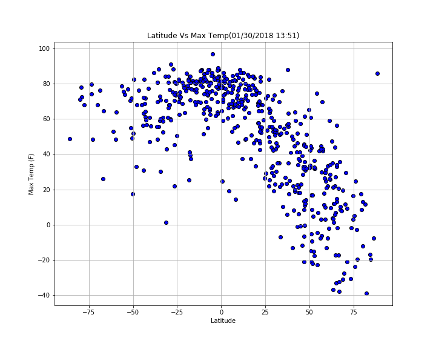
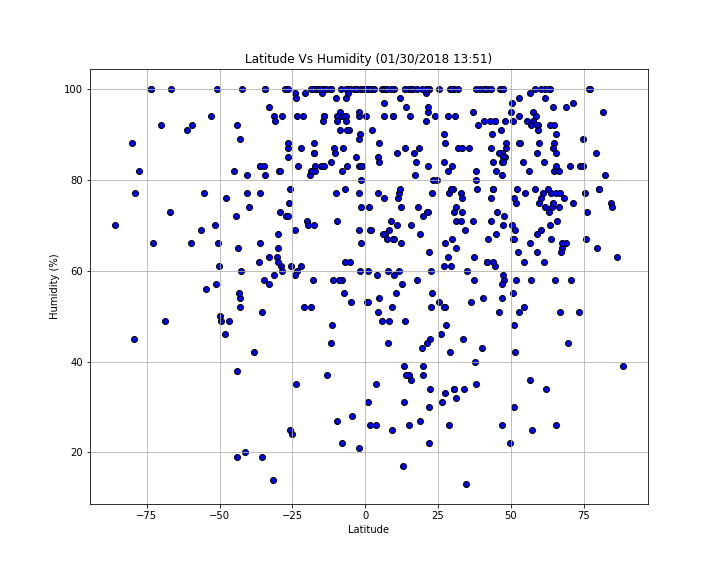
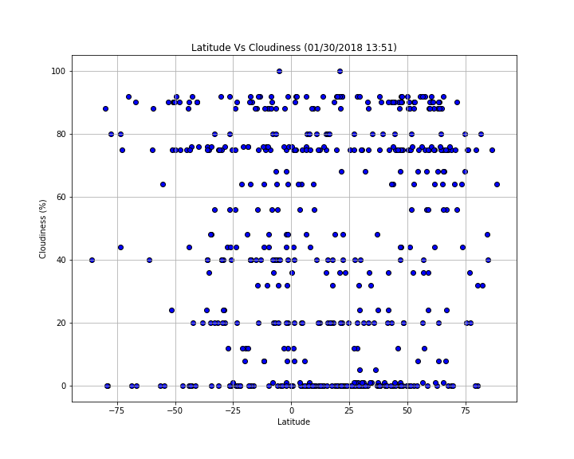
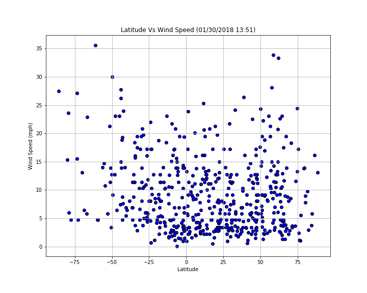

# API Interactions-Weather Analytics

### Objective:
Develop Python Scripts to visualize the weather of 500+ cities across the world of varying distance from the equator and create a representative model of weather across world cities.

### "What's the weather like as we approach the equator?" 
Whether financial, political, or social -- data's true power lies in its ability to answer questions definitively. Let's take a fundamental question: "What's the weather like as we approach the equator?"
Now, we know what you may be thinking: _"Duh. It gets hotter..."_
But, if pressed, how would you **prove** it? 

Created a Python script to visualize the weather of 500+ cities across the world of varying distance from the equator. To accomplish this, I used a python library https://pypi.python.org/pypi/citipy, Matplotlib and the [OpenWeatherMap API](https://openweathermap.org/api), and a little common sense to create a representative model of weather across world cities.

### A series of scatter plots to showcase the following relationships:
* Temperature (F) vs. Latitude

* Humidity (%) vs. Latitude

* Cloudiness (%) vs. Latitude

* Wind Speed (mph) vs. Latitude

### The final jupyter notebook contains the following:

* Randomly selected **at least** 500 unique (non-repeat) cities based on latitude and longitude using the citipy library.
* A weather check on each of the cities using a series of successive API calls using OpenWeatherAPI.
* Includes a print log of each city as it's being processed with the city number and city name.
* plotted the relationships using MatplotLib library in Python.
* Saved both a CSV of all data retrieved and png images for each scatter plot.

### Conducted a study on OpenWeatherMap API. 
Based on the initial study,the following basic questions about the API are answered:
* Where do you request the API key? 
* Which Weather API in particular will you need? 
* What URL endpoints does it expect? 
* What JSON structure does it respond with?

### Worked with Python library- citipy 
* deciphered how it works and why its relevant.
* how It can be used in conjunction with Open WeatherAPI.

### Limitations of the Dataset and tips followed to overcome it:
* Am I getting coverage of the full gamut of latitudes and longitudes? Or are you simply choosing 500 cities concentrated in one region of the world? Even a geographic geniuus, simply rattling 500 cities based on human selection would create a biased dataset !!
* The above issue was countered by considering full range of latitudes.

